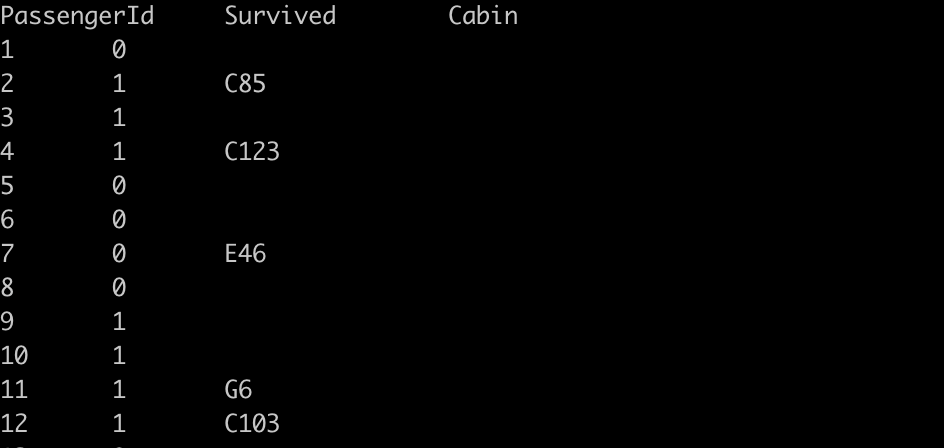
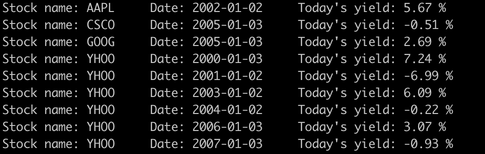

# Distributed-Statistical-Computing HomeWork

> **中央财经大学/应用统计20/王静/2020211027**

## 10/15: Hadoop Streaming

[toc]


本次作业是自己尝试写一个Hadoop Streaming代码。为了更方便和常规化地提交任务，我们首先写一个自己的`main.sh`文件。`main.sh`会包含一些我们常用的指令，之后只需要修改部分参数，就可以提交不同的MapReduce任务了。

### main.sh

`main.sh`需要输入四个参数，分别是：

1. mapper文件路径
2. reducer文件路径
3. 需要处理的文件路径
4. 输出结果的路径

然后在工程文件夹下运行`sh main.sh mapper reducer inputfile outputpath `代码，即可提交MapReduce。具体代码如下：

```shell
#!/bin/bash
echo '>>>>>>>>>>>>>>>> start:' `date`   #打印出任务开始时间
BEGIN_TIME=`date +%s`                   #将任务开始时间赋值给BEGIN_TIME,为了后续计算任务运行时间

set -u                                  #当执行时使用到未定义过的变量,则显示错误信息 

num=$#                        #得到输入参数的个数
if [ $num -ne 4 ]; then       #判断输入参数是否符合要求,否则输出提示信息
    echo -e "This program is designed for 1 mapper + 1 reducer + 1 inputfile."
    echo -e "Please input mapper file, reducer file name, input file path and result output path.
    echo -e "eg. sh main.sh mapper reducer inputfile outputpath"
    exit 1                    #如果参数个数不正确,退出任务
else           
    MAPPER=${1}               #参数正确,将参数赋给对应的变量
    REDUCER=${2}
    INPUTFILE=${3}
    OUTPUTPATH=${4}
fi

#设定任务的本地绝对路径
PWD=$(cd $(dirname $0); pwd) 
cd $PWD 1> /dev/null 2>&1

#设定任务名称
TASKNAME=task_wj

#hadoop配置
HADOOP_HOME=/usr/lib/hadoop-current              #hadoop安装路径
HADOOP_PREFIX=/user/devel/2020211027wangjing     #hadoop文件存放路径
HADOOP_INPUT_DIR=${HADOOP_PREFIX}/${INPUTFILE}   #输入文件在hadoop上的存放路径
HADOOP_OUTPUT_DIR=${HADOOP_PREFIX}/output/${OUTPUTPATH}    #输出文件夹在hadoop上的路径

#输出hadoop配置,便于检查是否设定错误
echo $HADOOP_HOME
echo $HADOOP_INPUT_DIR
echo $HADOOP_OUTPUT_DIR

#删除已有的输出文件夹
hadoop fs -rmr $HADOOP_OUTPUT_DIR 

#提交hadoop streaming任务
hadoop jar $HADOOP_HOME/share/hadoop/tools/lib/hadoop-streaming-3.1.3.jar \
    -input ${HADOOP_INPUT_DIR} \
    -output ${HADOOP_OUTPUT_DIR} \
    -file ${MAPPER} ${REDUCER} \
    -mapper ${MAPPER} \
    -reducer ${REDUCER}

#如果任务输出结果不等于0,说明任务出错,退出任务
if [ $? -ne 0 ]; then
    echo 'error'
    exit 1
fi

END_TIME=`date +%s`       

#如果任务运行成功,计算任务运行时间,并打印成功信息
echo '******Total cost '  $(($END_TIME-$BEGIN_TIME)) ' seconds'
echo '>>>>>>>>>>>>>>>> end:' `date`
echo "=============SUCCESSFUL============="

exit 0
```


###  Eg1: python+bash

> **Todo：输出数据集中符合要求的某几列**
>
> Mapper: mapper.sh
>
> Reducer: reducer.py

运行：`sh main.sh mapper.sh reducer.py titanic.csv output/python+bash`

#### Mapper: mapper.sh

打印出数据集的其中四列。

```shell
#! /bin/bash

awk -F '\t' '{printf ("%s\t%s\t%s\t%s\n", $1, $2, $4,$5)}'
```

#### Reducer: reducer.py

打印出`t.txt`中标注出的行中的两列数据。

```python
#! /usr/bin/python python3

import os
import sys

f = open('t.txt', 'r')
d = {}
for line in f:
    cs = line.strip()
    d[cs] = 0
f.close()


d1 = []
for line in sys.stdin:
    l = line.strip().split('\t')
    if len(l) != 4:
        continue
    [PassengerId, Survived, Sex, Age] = l
    if PassengerId in d and PassengerId not in d1:
        d1.append(PassengerId)
        res = [PassengerId, Survived]
        print('\t'.join(res))
```

#### Result


###  Eg2: print-colums

> **Todo：选择输出数据集中第1、2、10、12列的数据**
>
> Mapper: mapper.sh
>
> Reducer: cat（系统自带）

运行：`sh main.sh mapper.sh /usr/bin/cat titanic.csv output/print-colums`

#### Mapper: mapper.sh

```shell
#! /bin/bash

# print some columns of my data
awk -F ',' '{printf ("%s\t%s\t%s\t%s\n",  $1, $2, $10, $12)}'
```

#### Result




###  Eg3: python-stdin

> **Todo：计算输入文件的行数**
>
> Mapper: cat（系统自带）
>
> Reducer: wc.py

运行：`sh main.sh /usr/bin/cat wc.py LICENSE.txt output/python-stdin`

#### Reducer: wc.py

```python
#! /usr/bin/env python3
#第一行是指定python3路径

import  sys
count = 0
data = []
for line in sys.stdin:
  count += 1
  data.append(line)
print(count) #print goes to sys.stdout  
```

#### Result


###  Eg4: stocks

> **Todo：计算各支股票各天的平均收益**
>
> Mapper: mapper.py
>
> Reducer: stock_day_avg.R

运行：`sh main.sh mapper.py stock_day_avg.R stocks.txt output/stocks`

#### Mapper: mapper.py

```python
#! /usr/bin/env python3
import sys

for line in sys.stdin:
    part = line.strip()
    print(part)
```

#### Reducer: stock_day_avg.R

```R
#! /usr/bin/env Rscript

options(warn=-1)
sink("/dev/null")

input <- file("stdin", "r")
while(length(currentLine <- readLines(input, n=1, warn=FALSE)) > 0)
{
    fields <- unlist(strsplit(currentLine, ","))
    lowHigh <- c(as.double(fields[3]), as.double(fields[6]))
    stock_mean <- mean(lowHigh)
    #sink()
    cat(fields[1], fields[2], stock_mean, "\n", sep="\t")
    #sink("/dev/null")
}

close(input)
```

#### Result


###  Try-My: Titanic survival

根据上面对老师提供例子的尝试，已经初步掌握了写Hadoop Streaming的能力，因此尝试用自己的数据集写一个自己的程序。

> **Todo：计算titanic一共存活人数、男性人数、女性人数和所有乘客的平均年龄。**
>
> Mapper: mapper.py
>
> Reducer: reducer.py

运行：`sh main.sh mapper.py reducer.py titanic.csv output/titanic-survival`

#### Mapper: mapper.py

打印出数据集的第1、3、4列，分别代表是否存活、性别和年龄。

```python
#! /usr/bin/env python3
import sys

i = 1
for line in sys.stdin:
    if i == 1:   #跳过标题行
        i = 0
        continue
    col = line.strip().split(',')
    cols = [col[i] for i in (1,3,4)]  #[Survived,Pclass,Sex,Age]
    line = '\t'.join(cols)
    print(line) 
```

#### Reducer: reducer.py

计算一共存活人数、男性人数、女性人数和所有乘客的平均年龄。

```python
#! /usr/bin/env python3

import sys

survive = 0
male = 0
female = 0
age = []

# line_i: [Survived,Sex,Age]
for line in sys.stdin:
    cols = line.strip().split('\t')
    survive += int(cols[0])
    if cols[1] == 'male':
        male += 1
    else:
        female += 1
    age.append(float(cols[2]))

avg_age = sum(age) / len(age)
print("Total Survived:{}\tMale:{}\tFemale:{}\t\t\tAll passengers's average age is {}".format(survive,male,female,round(avg_age,2)))
```

#### Result

