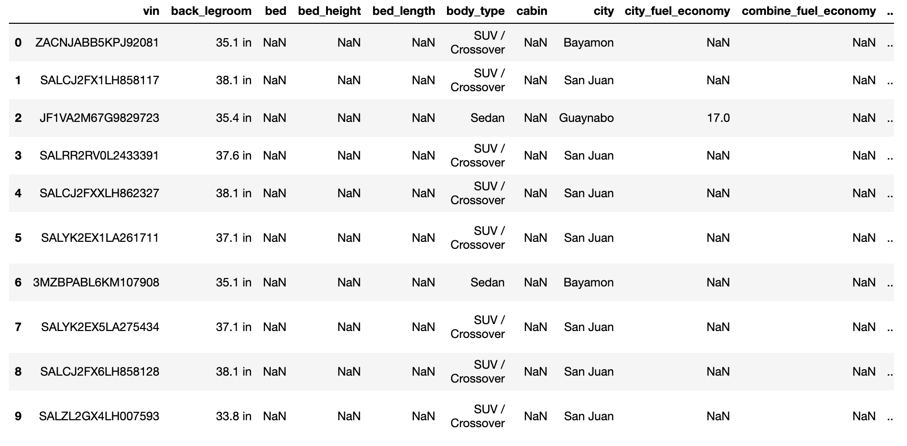
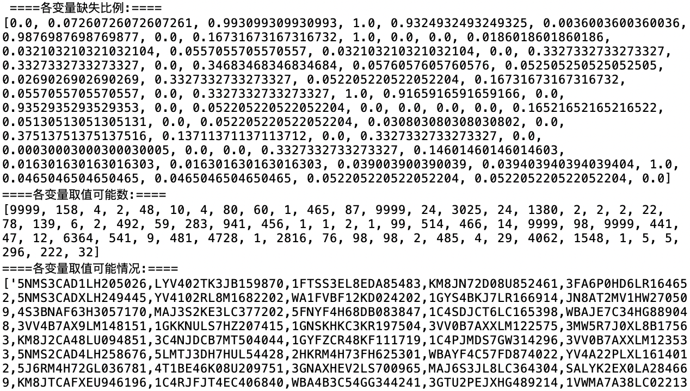
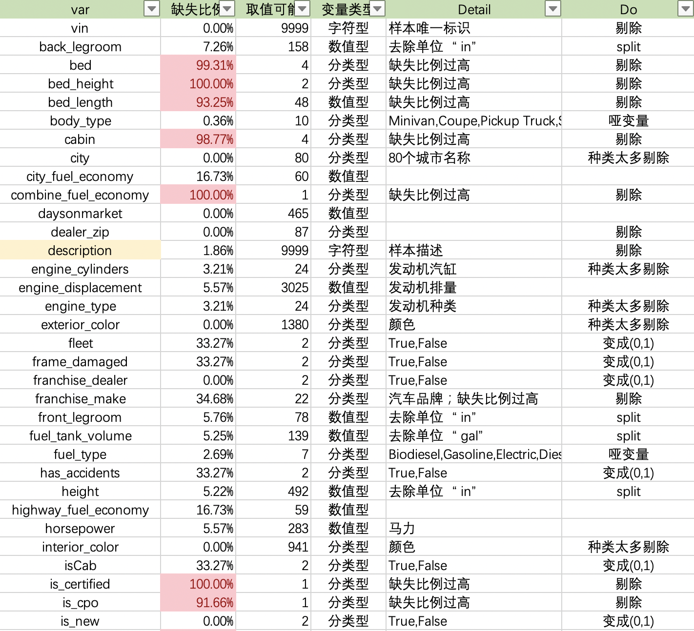
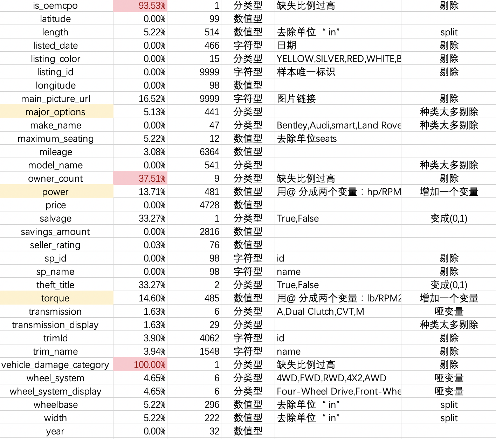
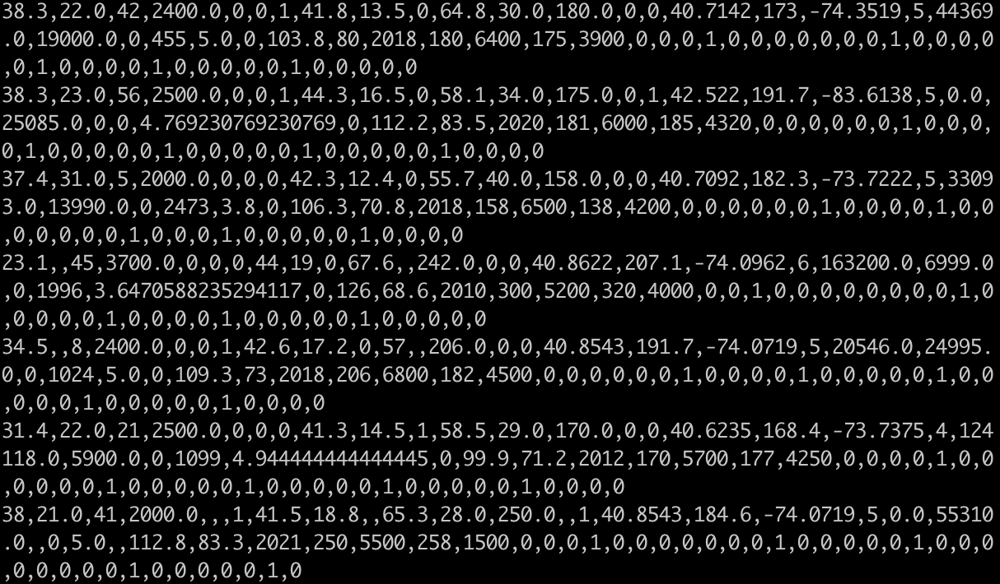

# Distributed-Statistical-Computing HomeWork


## 10/22: Data Cleaning

[toc]

本次作业针对Kaggle上的[US Used cars dataset](https://www.kaggle.com/ananaymital/us-used-cars-dataset)进行数据清洗。数据预览如下：



原始数据集中有**3000,000**条样本，**66**个变量。由于目前数据集中有许多无用变量及无法使用的变量，为了得到能够进行后续分析的数据集，首先我们先查看一下数据集中各个变量的缺失情况与取值情况。（考虑到原始数据量较大且服务器压力较大，后面先利用10000条样本的数据集进行说明。）

### 1. 缺失值情况及变量可能取值情况分析

首先我们写一个mapper程序，计算数据集中所有变量的缺失值个数，并输出各个变量的可能取值集合及集合内的元素个数。

#### missing.sh

```bash
#!/bin/bash
echo "===================================================================="
echo -e "\033[33m [INFO] 计算各变量缺失值个数及可能取值数 \033[0m "
echo "===================================================================="

echo '>>>>>>>>>>>>>>>> start:' `date`
BEGIN_TIME=`date +%s`

# main dir
PWD=$(cd $(dirname $0); pwd)
cd $PWD 1> /dev/null 2>&1

TASKNAME=task_wj

# hadoop client
HADOOP_HOME=/usr/lib/hadoop-current
HADOOP_PREFIX=/user/devel/2020211027wangjing
HADOOP_INPUT_DIR=${HADOOP_PREFIX}/sample_10000.csv
HADOOP_OUTPUT_DIR=${HADOOP_PREFIX}/output/1015-preprocess/missing

echo $HADOOP_HOME
echo $HADOOP_INPUT_DIR
echo $HADOOP_OUTPUT_DIR

hadoop fs -rmr $HADOOP_OUTPUT_DIR #删除已有的output文件夹

hadoop jar $HADOOP_HOME/share/hadoop/tools/lib/hadoop-streaming-3.1.3.jar \
    -input ${HADOOP_INPUT_DIR} \
    -output ${HADOOP_OUTPUT_DIR} \
    -file 'missing.py' 'merge.py' \
    -mapper "python3 missing.py" \
    -reducer "python3 merge.py"

if [ $? -ne 0 ]; then
    echo 'error'
    exit 1
fi

END_TIME=`date +%s`

echo '******Total cost '  $(($END_TIME-$BEGIN_TIME)) ' seconds'
echo '>>>>>>>>>>>>>>>> end:' `date`
echo "=============SUCCESS=============="

echo "===================================================================="
echo -e "\033[33m [INFO] 各变量缺失值个数及可能取值数为: \033[0m "
hadoop fs -cat ${HADOOP_OUTPUT_DIR}/*
echo "===================================================================="

exit 0
```

运行`sh missing.sh`进行第一步数据处理。

#### missing.py

```python
#! /usr/env/python python3

######---------------计算各变量缺失值个数,可能取值数及取值情况---------------#######

import sys,re,csv
import numpy as np
import logging

# 配置日志
logging.basicConfig(filename='logger.log', level=logging.INFO, format=' %(asctime)s - %(levelname)s - %(message)s')
logging.info('======Start!=====')
logging.info('Get ready to count missing values...')

# 设置变量初始值
count = 0
uniques = [[] for i in range(66)]
missing = np.array([0 for i in range(66)])
isnull = [None,'',' ','-','--']

# 开始读取数据
lines = csv.reader(sys.stdin)
for line in lines:
    n = len(line)
    if line[0] == 'vin': 
        continue
    
    try: 
        assert n == 66  #判断正则表达式是否匹配正确
        count += 1

        uniques = [uniques[i]+[line[i]] if line[i] not in uniques[i] else uniques[i] for i in range(n)]
        miss_ind = [i in isnull for i in line ]
        missing[miss_ind] += 1

    except:
        continue

# 生成输出数据
var_miss = [str(x) for x in np.insert(missing,0,count)]
var_out = ','.join(var_miss)

uniq_num = [str(len(uniq)) for uniq in uniques]
uniq_num_out = ','.join(uniq_num)

uniq_det = [','.join(uniq) for uniq in uniques]
uniq_out = ';'.join(uniq_det)

# 输出格式: 缺失值数 \t 可能取值数 \t 所有可能取值列表(var1;var2;...;varN)
# count,missing1,missing2,...,missingN \t  uniq1,uniq2,...,uniqN \t u1,u2,u3;u1;u2,u3;...
print(var_out,'\t',uniq_num_out,'\t',uniq_out,'\n')
```

运行`missing.py`会对所有数据进行处理。由于利用Hadoop计算时总数据集会被分成若干个map，因此可能会输出若干行数据。因此，需要利用`merge.py`对这些数据进行合并，得到我们的第一步数据分析报告。

#### merge.py

```python
#! /usr/env/python python3

######---------------合并missing处理结果---------------#######

import sys,re,csv
import numpy as np
import logging

# 配置日志
logging.basicConfig(filename='logger.log', level=logging.INFO, format=' %(asctime)s - %(levelname)s - %(message)s')
logging.info('正在合并第一步预处理结果...')

missing = []
uniques = [[] for i in range(66)]

for line in sys.stdin:
    line = line.split('\t')
    missing += map(int,line[0].split(','))
    uniq = line[2].split(';')
    uniques = [list(set(uniques[i]+uniq[i].split(','))) for i in range(66)]

var_miss = [i/missing[0] for i in missing[1:]]
uniq_num = [len(uniq) for uniq in uniques]
uniq_det = [','.join(uniq) for uniq in uniques]
uniq_out = ';'.join(uniq_det)

print('====各变量缺失比例:====')
print(var_miss)

print('====各变量取值可能数:====')
print(uniq_num)

print('====各变量取值可能情况:====')
print(uniq_out)
```


经过第一步，会得到所有变量的输出报告，如下：



根据这个输出报告，结合之前的数据预览，我们可以进一步确定各个变量需要进行的处理。


### 2. 缺失值处理、变量剔除及数据格式转换

根据第一步得到的数据报告，分别分析各个变量的情况，得到下表：





根据表中分析结果编写MapReduce程序进行预处理。具体逻辑如下：

- 删除标题行
- 如果数据读取是否正确，如果错误，跳过该条样本
- 删除部分数值型变量中的单位（可能为in、seats、gal、RPM等）
- 将二分类变量`(True,False)`记为`(0，1)`
- 将部分存在同一个变量中的数值型变量分离
- 对分类变量产生哑变量
- 剔除不适合进行数据分析的变量

#### clean.sh

```bash
#!/bin/bash
echo "===================================================================="
echo -e "\033[33m [INFO] 缺失值处理、变量剔除及数据格式转换 \033[0m "
echo "===================================================================="

echo '>>>>>>>>>>>>>>>> start:' `date`
BEGIN_TIME=`date +%s`

# main dir
PWD=$(cd $(dirname $0); pwd)
cd $PWD 1> /dev/null 2>&1

TASKNAME=task_wj

# hadoop client
HADOOP_HOME=/usr/lib/hadoop-current
HADOOP_PREFIX=/user/devel/2020211027wangjing
HADOOP_INPUT_DIR=${HADOOP_PREFIX}/sample_10000.csv
HADOOP_OUTPUT_DIR=${HADOOP_PREFIX}/output/1015-preprocess/

echo $HADOOP_HOME
echo $HADOOP_INPUT_DIR
echo $HADOOP_OUTPUT_DIR

hadoop fs -rmr $HADOOP_OUTPUT_DIR #删除已有的output文件夹

hadoop jar $HADOOP_HOME/share/hadoop/tools/lib/hadoop-streaming-3.1.3.jar \
    -input ${HADOOP_INPUT_DIR} \
    -output ${HADOOP_OUTPUT_DIR} \
    -file 'clean.py' \
    -mapper "python3 clean.py" 

if [ $? -ne 0 ]; then
    echo 'error'
    exit 1
fi

END_TIME=`date +%s`

echo '******Total cost '  $(($END_TIME-$BEGIN_TIME)) ' seconds'
echo '>>>>>>>>>>>>>>>> end:' `date`
echo "=============SUCCESS=============="

exit 0
```

运行`sh missing.sh`进行数据清洗。

#### clean.py

```python
#! /usr/env/python python3

######---------------缺失值处理、变量剔除及数据格式转换---------------#######

import sys,re,csv
import numpy as np
import logging

# 配置日志
logging.basicConfig(filename='logger.log', level=logging.INFO, format=' %(asctime)s - %(levelname)s - %(message)s')
logging.info('Get ready to clean the data...')

# 设置变量初始值
isnull = [None,'',' ','-','--']
unit = re.compile(r'(?<=\d) (in|seats|gal|RPM)')

drop_list = [0, 2, 3, 4, 6, 7, 9, 11, 12, 13, 15, 16, 20, 28, 30, 31, 33, 36, 37, 38, 40, 41, 42, 45, 46, 52, 53, 57, 58, 59, 60]
num_list = [1, 8, 10, 14, 21, 22, 25, 26, 27, 34, 35, 39, 43, 44, 48, 50, 51, 63, 64, 65]
cla_list = [5, 17, 18, 19, 23, 24, 29, 32, 49, 54, 56, 61, 62]

# 理论上经过处理后的list
drop_list += [47, 55] + [5,23,56,61,62]
num_list  += [66, 67, 68, 69]

# 分类变量
body_type = ['Minivan','Coupe','Pickup Truck','SUV / Crossover','Hatchback','Wagon','Sedan','Convertible','Van','Others']
fuel_type = ['Biodiesel','Gasoline','Electric','Diesel','Flex Fuel Vehicle','Hybrid','Others']
transmission = ['A','Dual Clutch','CVT','M','Others']
wheel_system = ['4WD','FWD','RWD','4X2','AWD','Others']
listing_color = ['YELLOW','SILVER','RED','WHITE','BLUE','UNKNOWN','BROWN','ORANGE','PURPLE','BLACK','GREEN','TEAL','GRAY','GOLD','Others']
wheel_system_display = ['Four-Wheel Drive','Front-Wheel Drive','4X2','Rear-Wheel Drive','All-Wheel Drive','Others']

def get_dummy(li,lst):
    #针对分类变量生成哑变量
    if li in [None,'',' ','-','--']:
        return [0]*len(lst)
    else:
        dummy_new = [0]*len(lst)
        index = lst.index(li) if li in lst else -1  #如果不在备选列表中,记为Others
        dummy_new[index] = 1
        return dummy_new

# 开始读取数据
lines = csv.reader(sys.stdin)
for line in lines:
    if line[0] == 'vin': 
        continue
    
    try: 
        line = [i.strip().strip('\n') for i in line]
        assert len(line) == 66  #判断正则表达式是否匹配正确

        # 去除单位
        line = [re.sub('--', '', i) for i in line]
        line = [re.sub(unit, '', i) for i in line]

        # 逻辑分类变量处理
        line = [re.sub('FALSE', '0', i, flags=re.IGNORECASE) for i in line]
        line = [re.sub('TRUE' , '1', i, flags=re.IGNORECASE) for i in line]

        # 47,55 新增一个变量
        power  = re.split(r' hp @ ', re.sub('[",]', '', line[47]))
        torque = re.split(r' lb-ft @ ', re.sub('[",]', '', line[55]))
        line  += power + torque

        # 分类变量处理
        line += get_dummy(line[5],body_type)  # body_type:5 [70-79] 10
        line += get_dummy(line[23],fuel_type)  # fuel_type:23 [80-86] 7
        line += get_dummy(line[56],transmission)  # transmission:56 [87-91] 6
        line += get_dummy(line[61],wheel_system)  # wheel_system:61 [92-97] 6
        line += get_dummy(line[62],wheel_system_display)  # wheel_system_display:62 [98-103] 6

        # 处理数值变量
        # line = [float(line[i]) if i in num_list and line[i] not in isnull else line[i] for i in range(len(line))]
        
        # 剔除变量
        line = [str(line[i]) for i in range(len(line)) if i not in drop_list]

        if len(line) == 66 :
            print(','.join(line))

    except:
        continue
```

在经过这一步处理后，我们得到了一个初步能够进行建模的数据集，数据集中的每条样本经过原始处理后都包括**66**个变量，不再包含字符型变量，且已经对分类变量生成了哑变量，数据用逗号分隔。数据集预览如下：

