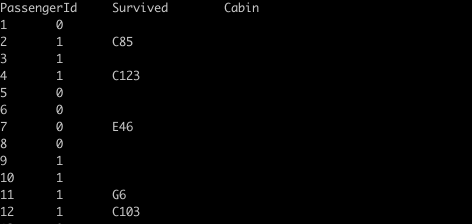
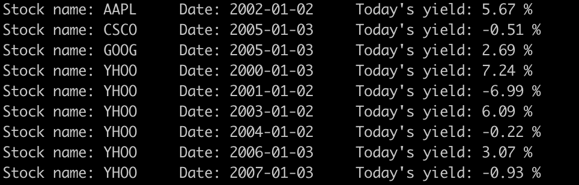
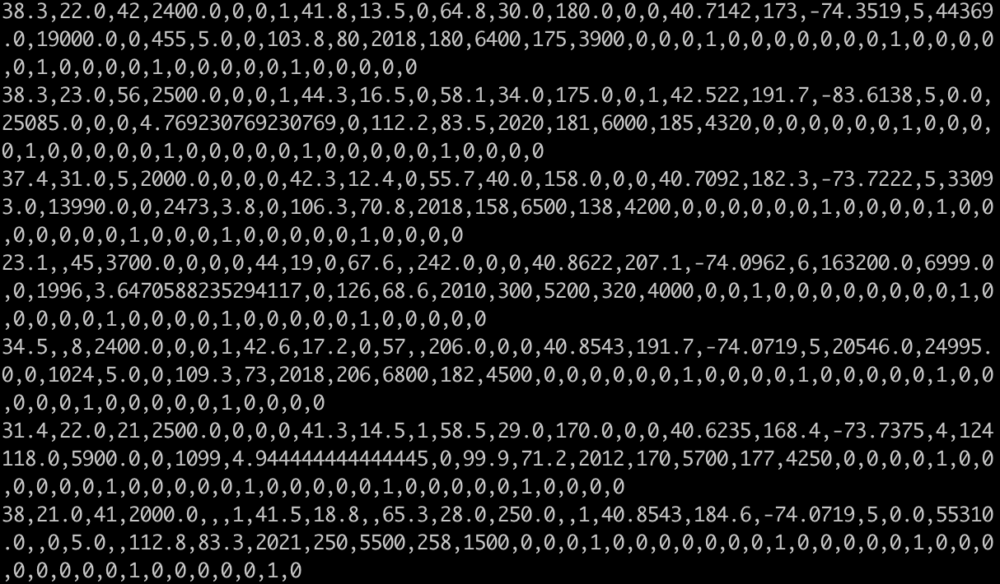

# Distributed-Statistical-Computing-Work

**😸Author: [WangZiduan](https://github.com/wj19816)**

Big Data course series of Central University of Finance and Economics, lecture notes and assignments of Distributed Computing taught by Li Feng.

This repository records some of my exercises in distributed computing classes.

[toc]

## 10/15: Hadoop Streaming


本次作业是自己尝试写一个Hadoop Streaming代码。为了更方便和常规化地提交任务，我们首先写一个自己的`main.sh`文件。`main.sh`会包含一些我们常用的指令，之后只需要修改部分参数，就可以提交不同的MapReduce任务了。

### main.sh

`main.sh`需要输入四个参数，分别是：

1. mapper文件路径
2. reducer文件路径
3. 需要处理的文件路径
4. 输出结果的路径

然后在工程文件夹下运行`sh main.sh mapper reducer inputfile outputpath `代码，即可提交MapReduce。具体代码如下：

```shell
#!/bin/bash
echo '>>>>>>>>>>>>>>>> start:' `date`   #打印出任务开始时间
BEGIN_TIME=`date +%s`                   #将任务开始时间赋值给BEGIN_TIME,为了后续计算任务运行时间

set -u                                  #当执行时使用到未定义过的变量,则显示错误信息 

num=$#                        #得到输入参数的个数
if [ $num -ne 4 ]; then       #判断输入参数是否符合要求,否则输出提示信息
    echo -e "This program is designed for 1 mapper + 1 reducer + 1 inputfile."
    echo -e "Please input mapper file, reducer file name, input file path and result output path.
    echo -e "eg. sh main.sh mapper reducer inputfile outputpath"
    exit 1                    #如果参数个数不正确,退出任务
else           
    MAPPER=${1}               #参数正确,将参数赋给对应的变量
    REDUCER=${2}
    INPUTFILE=${3}
    OUTPUTPATH=${4}
fi

#设定任务的本地绝对路径
PWD=$(cd $(dirname $0); pwd) 
cd $PWD 1> /dev/null 2>&1

#设定任务名称
TASKNAME=task_wj

#hadoop配置
HADOOP_HOME=/usr/lib/hadoop-current              #hadoop安装路径
HADOOP_PREFIX=/user/devel/path     #hadoop文件存放路径
HADOOP_INPUT_DIR=${HADOOP_PREFIX}/${INPUTFILE}   #输入文件在hadoop上的存放路径
HADOOP_OUTPUT_DIR=${HADOOP_PREFIX}/output/${OUTPUTPATH}    #输出文件夹在hadoop上的路径

#输出hadoop配置,便于检查是否设定错误
echo $HADOOP_HOME
echo $HADOOP_INPUT_DIR
echo $HADOOP_OUTPUT_DIR

#删除已有的输出文件夹
hadoop fs -rmr $HADOOP_OUTPUT_DIR 

#提交hadoop streaming任务
hadoop jar $HADOOP_HOME/share/hadoop/tools/lib/hadoop-streaming-3.1.3.jar \
    -input ${HADOOP_INPUT_DIR} \
    -output ${HADOOP_OUTPUT_DIR} \
    -file ${MAPPER} ${REDUCER} \
    -mapper ${MAPPER} \
    -reducer ${REDUCER}

#如果任务输出结果不等于0,说明任务出错,退出任务
if [ $? -ne 0 ]; then
    echo 'error'
    exit 1
fi

END_TIME=`date +%s`       

#如果任务运行成功,计算任务运行时间,并打印成功信息
echo '******Total cost '  $(($END_TIME-$BEGIN_TIME)) ' seconds'
echo '>>>>>>>>>>>>>>>> end:' `date`
echo "=============SUCCESSFUL============="

exit 0
```


###  Eg1: python+bash

> **Todo：输出数据集中符合要求的某几列**
>
> Mapper: mapper.sh
>
> Reducer: reducer.py

运行：`sh main.sh mapper.sh reducer.py titanic.csv output/python+bash`

#### Mapper: mapper.sh

打印出数据集的其中四列。

```shell
#! /bin/bash

awk -F '\t' '{printf ("%s\t%s\t%s\t%s\n", $1, $2, $4,$5)}'
```

#### Reducer: reducer.py

打印出`t.txt`中标注出的行中的两列数据。

```python
#! /usr/bin/python python3

import os
import sys

f = open('t.txt', 'r')
d = {}
for line in f:
    cs = line.strip()
    d[cs] = 0
f.close()


d1 = []
for line in sys.stdin:
    l = line.strip().split('\t')
    if len(l) != 4:
        continue
    [PassengerId, Survived, Sex, Age] = l
    if PassengerId in d and PassengerId not in d1:
        d1.append(PassengerId)
        res = [PassengerId, Survived]
        print('\t'.join(res))
```

#### Result


###  Eg2: print-colums

> **Todo：选择输出数据集中第1、2、10、12列的数据**
>
> Mapper: mapper.sh
>
> Reducer: cat（系统自带）

运行：`sh main.sh mapper.sh /usr/bin/cat titanic.csv output/print-colums`

#### Mapper: mapper.sh

```shell
#! /bin/bash

# print some columns of my data
awk -F ',' '{printf ("%s\t%s\t%s\t%s\n",  $1, $2, $10, $12)}'
```

#### Result




###  Eg3: python-stdin

> **Todo：计算输入文件的行数**
>
> Mapper: cat（系统自带）
>
> Reducer: wc.py

运行：`sh main.sh /usr/bin/cat wc.py LICENSE.txt output/python-stdin`

#### Reducer: wc.py

```python
#! /usr/bin/env python3
#第一行是指定python3路径

import  sys
count = 0
data = []
for line in sys.stdin:
  count += 1
  data.append(line)
print(count) #print goes to sys.stdout  
```

#### Result


###  Eg4: stocks

> **Todo：计算各支股票各天的平均收益**
>
> Mapper: mapper.py
>
> Reducer: stock_day_avg.R

运行：`sh main.sh mapper.py stock_day_avg.R stocks.txt output/stocks`

#### Mapper: mapper.py

```python
#! /usr/bin/env python3
import sys

for line in sys.stdin:
    part = line.strip()
    print(part)
```

#### Reducer: stock_day_avg.R

```R
#! /usr/bin/env Rscript

options(warn=-1)
sink("/dev/null")

input <- file("stdin", "r")
while(length(currentLine <- readLines(input, n=1, warn=FALSE)) > 0)
{
    fields <- unlist(strsplit(currentLine, ","))
    lowHigh <- c(as.double(fields[3]), as.double(fields[6]))
    stock_mean <- mean(lowHigh)
    #sink()
    cat(fields[1], fields[2], stock_mean, "\n", sep="\t")
    #sink("/dev/null")
}

close(input)
```

#### Result


###  Try-My: Titanic survival

根据上面对老师提供例子的尝试，已经初步掌握了写Hadoop Streaming的能力，因此尝试用自己的数据集写一个自己的程序。

> **Todo：计算titanic一共存活人数、男性人数、女性人数和所有乘客的平均年龄。**
>
> Mapper: mapper.py
>
> Reducer: reducer.py

运行：`sh main.sh mapper.py reducer.py titanic.csv output/titanic-survival`

#### Mapper: mapper.py

打印出数据集的第1、3、4列，分别代表是否存活、性别和年龄。

```python
#! /usr/bin/env python3
import sys

i = 1
for line in sys.stdin:
    if i == 1:   #跳过标题行
        i = 0
        continue
    col = line.strip().split(',')
    cols = [col[i] for i in (1,3,4)]  #[Survived,Pclass,Sex,Age]
    line = '\t'.join(cols)
    print(line) 
```

#### Reducer: reducer.py

计算一共存活人数、男性人数、女性人数和所有乘客的平均年龄。

```python
#! /usr/bin/env python3

import sys

survive = 0
male = 0
female = 0
age = []

# line_i: [Survived,Sex,Age]
for line in sys.stdin:
    cols = line.strip().split('\t')
    survive += int(cols[0])
    if cols[1] == 'male':
        male += 1
    else:
        female += 1
    age.append(float(cols[2]))

avg_age = sum(age) / len(age)
print("Total Survived:{}\tMale:{}\tFemale:{}\t\t\tAll passengers's average age is {}".format(survive,male,female,round(avg_age,2)))
```

#### Result




## 10/22: Data Cleaning

本次作业针对Kaggle上的[US Used cars dataset](https://www.kaggle.com/ananaymital/us-used-cars-dataset)进行数据清洗。数据预览如下：


原始数据集中有**3000,000**条样本，**66**个变量。由于目前数据集中有许多无用变量及无法使用的变量，为了得到能够进行后续分析的数据集，首先我们先查看一下数据集中各个变量的缺失情况与取值情况。（考虑到原始数据量较大且服务器压力较大，后面先利用10000条样本的数据集进行说明。）

### 1. 缺失值情况及变量可能取值情况分析

首先我们写一个mapper程序，计算数据集中所有变量的缺失值个数，并输出各个变量的可能取值集合及集合内的元素个数。

#### missing.sh

```bash
#!/bin/bash
echo "===================================================================="
echo -e "\033[33m [INFO] 计算各变量缺失值个数及可能取值数 \033[0m "
echo "===================================================================="

echo '>>>>>>>>>>>>>>>> start:' `date`
BEGIN_TIME=`date +%s`

# main dir
PWD=$(cd $(dirname $0); pwd)
cd $PWD 1> /dev/null 2>&1

TASKNAME=task_wj

# hadoop client
HADOOP_HOME=/usr/lib/hadoop-current
HADOOP_PREFIX=/user/devel/path
HADOOP_INPUT_DIR=${HADOOP_PREFIX}/sample_10000.csv
HADOOP_OUTPUT_DIR=${HADOOP_PREFIX}/output/1015-preprocess/missing

echo $HADOOP_HOME
echo $HADOOP_INPUT_DIR
echo $HADOOP_OUTPUT_DIR

hadoop fs -rmr $HADOOP_OUTPUT_DIR #删除已有的output文件夹

hadoop jar $HADOOP_HOME/share/hadoop/tools/lib/hadoop-streaming-3.1.3.jar \
    -input ${HADOOP_INPUT_DIR} \
    -output ${HADOOP_OUTPUT_DIR} \
    -file 'missing.py' 'merge.py' \
    -mapper "python3 missing.py" \
    -reducer "python3 merge.py"

if [ $? -ne 0 ]; then
    echo 'error'
    exit 1
fi

END_TIME=`date +%s`

echo '******Total cost '  $(($END_TIME-$BEGIN_TIME)) ' seconds'
echo '>>>>>>>>>>>>>>>> end:' `date`
echo "=============SUCCESS=============="

echo "===================================================================="
echo -e "\033[33m [INFO] 各变量缺失值个数及可能取值数为: \033[0m "
hadoop fs -cat ${HADOOP_OUTPUT_DIR}/*
echo "===================================================================="

exit 0
```

运行`sh missing.sh`进行第一步数据处理。

#### missing.py

```python
#! /usr/env/python python3

######---------------计算各变量缺失值个数,可能取值数及取值情况---------------#######

import sys,re,csv
import numpy as np
import logging

# 配置日志
logging.basicConfig(filename='logger.log', level=logging.INFO, format=' %(asctime)s - %(levelname)s - %(message)s')
logging.info('======Start!=====')
logging.info('Get ready to count missing values...')

# 设置变量初始值
count = 0
uniques = [[] for i in range(66)]
missing = np.array([0 for i in range(66)])
isnull = [None,'',' ','-','--']

# 开始读取数据
lines = csv.reader(sys.stdin)
for line in lines:
    n = len(line)
    if line[0] == 'vin': 
        continue
    
    try: 
        assert n == 66  #判断正则表达式是否匹配正确
        count += 1

        uniques = [uniques[i]+[line[i]] if line[i] not in uniques[i] else uniques[i] for i in range(n)]
        miss_ind = [i in isnull for i in line ]
        missing[miss_ind] += 1

    except:
        continue

# 生成输出数据
var_miss = [str(x) for x in np.insert(missing,0,count)]
var_out = ','.join(var_miss)

uniq_num = [str(len(uniq)) for uniq in uniques]
uniq_num_out = ','.join(uniq_num)

uniq_det = [','.join(uniq) for uniq in uniques]
uniq_out = ';'.join(uniq_det)

# 输出格式: 缺失值数 \t 可能取值数 \t 所有可能取值列表(var1;var2;...;varN)
# count,missing1,missing2,...,missingN \t  uniq1,uniq2,...,uniqN \t u1,u2,u3;u1;u2,u3;...
print(var_out,'\t',uniq_num_out,'\t',uniq_out,'\n')
```

运行`missing.py`会对所有数据进行处理。由于利用Hadoop计算时总数据集会被分成若干个map，因此可能会输出若干行数据。因此，需要利用`merge.py`对这些数据进行合并，得到我们的第一步数据分析报告。

#### merge.py

```python
#! /usr/env/python python3

######---------------合并missing处理结果---------------#######

import sys,re,csv
import numpy as np
import logging

# 配置日志
logging.basicConfig(filename='logger.log', level=logging.INFO, format=' %(asctime)s - %(levelname)s - %(message)s')
logging.info('正在合并第一步预处理结果...')

missing = []
uniques = [[] for i in range(66)]

for line in sys.stdin:
    line = line.split('\t')
    missing += map(int,line[0].split(','))
    uniq = line[2].split(';')
    uniques = [list(set(uniques[i]+uniq[i].split(','))) for i in range(66)]

var_miss = [i/missing[0] for i in missing[1:]]
uniq_num = [len(uniq) for uniq in uniques]
uniq_det = [','.join(uniq) for uniq in uniques]
uniq_out = ';'.join(uniq_det)

print('====各变量缺失比例:====')
print(var_miss)

print('====各变量取值可能数:====')
print(uniq_num)

print('====各变量取值可能情况:====')
print(uniq_out)
```


经过第一步，会得到所有变量的输出报告，如下：


根据这个输出报告，结合之前的数据预览，我们可以进一步确定各个变量需要进行的处理。


### 2. 缺失值处理、变量剔除及数据格式转换

根据第一步得到的数据报告，分别分析各个变量的情况，得到下表：


根据表中分析结果编写MapReduce程序进行预处理。具体逻辑如下：

- 删除标题行
- 如果数据读取是否正确，如果错误，跳过该条样本
- 删除部分数值型变量中的单位（可能为in、seats、gal、RPM等）
- 将二分类变量`(True,False)`记为`(0，1)`
- 将部分存在同一个变量中的数值型变量分离
- 对分类变量产生哑变量
- 剔除不适合进行数据分析的变量

#### clean.sh

```bash
#!/bin/bash
echo "===================================================================="
echo -e "\033[33m [INFO] 缺失值处理、变量剔除及数据格式转换 \033[0m "
echo "===================================================================="

echo '>>>>>>>>>>>>>>>> start:' `date`
BEGIN_TIME=`date +%s`

# main dir
PWD=$(cd $(dirname $0); pwd)
cd $PWD 1> /dev/null 2>&1

TASKNAME=task_wj

# hadoop client
HADOOP_HOME=/usr/lib/hadoop-current
HADOOP_PREFIX=/user/devel/path
HADOOP_INPUT_DIR=${HADOOP_PREFIX}/sample_10000.csv
HADOOP_OUTPUT_DIR=${HADOOP_PREFIX}/output/1015-preprocess/

echo $HADOOP_HOME
echo $HADOOP_INPUT_DIR
echo $HADOOP_OUTPUT_DIR

hadoop fs -rmr $HADOOP_OUTPUT_DIR #删除已有的output文件夹

hadoop jar $HADOOP_HOME/share/hadoop/tools/lib/hadoop-streaming-3.1.3.jar \
    -input ${HADOOP_INPUT_DIR} \
    -output ${HADOOP_OUTPUT_DIR} \
    -file 'clean.py' \
    -mapper "python3 clean.py" 

if [ $? -ne 0 ]; then
    echo 'error'
    exit 1
fi

END_TIME=`date +%s`

echo '******Total cost '  $(($END_TIME-$BEGIN_TIME)) ' seconds'
echo '>>>>>>>>>>>>>>>> end:' `date`
echo "=============SUCCESS=============="

exit 0
```

运行`sh missing.sh`进行数据清洗。

#### clean.py

```python
#! /usr/env/python python3

######---------------缺失值处理、变量剔除及数据格式转换---------------#######

import sys,re,csv
import numpy as np
import logging

# 配置日志
logging.basicConfig(filename='logger.log', level=logging.INFO, format=' %(asctime)s - %(levelname)s - %(message)s')
logging.info('Get ready to clean the data...')

# 设置变量初始值
isnull = [None,'',' ','-','--']
unit = re.compile(r'(?<=\d) (in|seats|gal|RPM)')

drop_list = [0, 2, 3, 4, 6, 7, 9, 11, 12, 13, 15, 16, 20, 28, 30, 31, 33, 36, 37, 38, 40, 41, 42, 45, 46, 52, 53, 57, 58, 59, 60]
num_list = [1, 8, 10, 14, 21, 22, 25, 26, 27, 34, 35, 39, 43, 44, 48, 50, 51, 63, 64, 65]
cla_list = [5, 17, 18, 19, 23, 24, 29, 32, 49, 54, 56, 61, 62]

# 理论上经过处理后的list
drop_list += [47, 55] + [5,23,56,61,62]
num_list  += [66, 67, 68, 69]

# 分类变量
body_type = ['Minivan','Coupe','Pickup Truck','SUV / Crossover','Hatchback','Wagon','Sedan','Convertible','Van','Others']
fuel_type = ['Biodiesel','Gasoline','Electric','Diesel','Flex Fuel Vehicle','Hybrid','Others']
transmission = ['A','Dual Clutch','CVT','M','Others']
wheel_system = ['4WD','FWD','RWD','4X2','AWD','Others']
listing_color = ['YELLOW','SILVER','RED','WHITE','BLUE','UNKNOWN','BROWN','ORANGE','PURPLE','BLACK','GREEN','TEAL','GRAY','GOLD','Others']
wheel_system_display = ['Four-Wheel Drive','Front-Wheel Drive','4X2','Rear-Wheel Drive','All-Wheel Drive','Others']

def get_dummy(li,lst):
    #针对分类变量生成哑变量
    if li in [None,'',' ','-','--']:
        return [0]*len(lst)
    else:
        dummy_new = [0]*len(lst)
        index = lst.index(li) if li in lst else -1  #如果不在备选列表中,记为Others
        dummy_new[index] = 1
        return dummy_new

# 开始读取数据
lines = csv.reader(sys.stdin)
for line in lines:
    if line[0] == 'vin': 
        continue
    
    try: 
        line = [i.strip().strip('\n') for i in line]
        assert len(line) == 66  #判断正则表达式是否匹配正确

        # 去除单位
        line = [re.sub('--', '', i) for i in line]
        line = [re.sub(unit, '', i) for i in line]

        # 逻辑分类变量处理
        line = [re.sub('FALSE', '0', i, flags=re.IGNORECASE) for i in line]
        line = [re.sub('TRUE' , '1', i, flags=re.IGNORECASE) for i in line]

        # 47,55 新增一个变量
        power  = re.split(r' hp @ ', re.sub('[",]', '', line[47]))
        torque = re.split(r' lb-ft @ ', re.sub('[",]', '', line[55]))
        line  += power + torque

        # 分类变量处理
        line += get_dummy(line[5],body_type)  # body_type:5 [70-79] 10
        line += get_dummy(line[23],fuel_type)  # fuel_type:23 [80-86] 7
        line += get_dummy(line[56],transmission)  # transmission:56 [87-91] 6
        line += get_dummy(line[61],wheel_system)  # wheel_system:61 [92-97] 6
        line += get_dummy(line[62],wheel_system_display)  # wheel_system_display:62 [98-103] 6

        # 处理数值变量
        # line = [float(line[i]) if i in num_list and line[i] not in isnull else line[i] for i in range(len(line))]
        
        # 剔除变量
        line = [str(line[i]) for i in range(len(line)) if i not in drop_list]

        if len(line) == 66 :
            print(','.join(line))

    except:
        continue
```

在经过这一步处理后，我们得到了一个初步能够进行建模的数据集，数据集中的每条样本经过原始处理后都包括**66**个变量，不再包含字符型变量，且已经对分类变量生成了哑变量，数据用逗号分隔。数据集预览如下：



